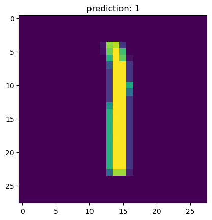
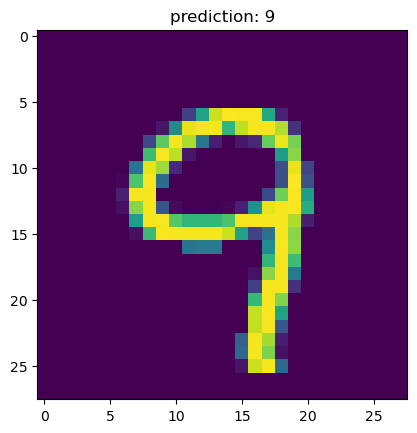
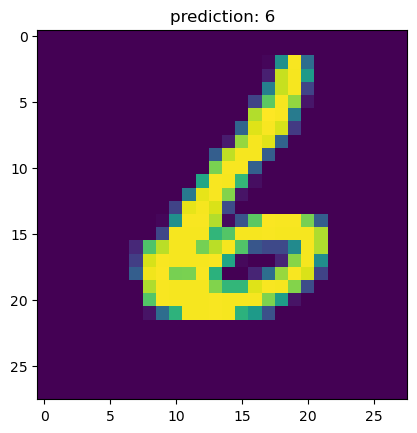
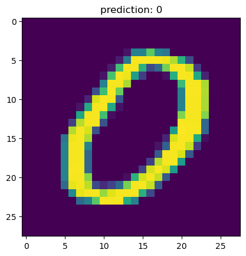

```python
import torch
from torch.utils.data import DataLoader
from torchvision import transforms
from torchvision.datasets import MNIST
import matplotlib.pyplot as plt
class Net(torch.nn.Module):
    def __init__(self):
        super().__init__()
        self.fc1=torch.nn.Linear(28*28,64)
        self.fc2=torch.nn.Linear(64,64)
        self.fc3=torch.nn.Linear(64,64)
        self.fc4=torch.nn.Linear(64,10)
    def forward(self,x):
        x=torch.nn.functional.relu(self.fc1(x))
        x=torch.nn.functional.relu(self.fc2(x))
        x=torch.nn.functional.relu(self.fc3(x))
        x=torch.nn.functional.log_softmax(self.fc4(x),dim=1)
        return x
def get_data_loader(is_train):#导入数据
    to_tensor=transforms.Compose([transforms.ToTensor()])
    data_set=MNIST("",is_train,transform=to_tensor,download=True)
    return DataLoader(data_set,batch_size=15,shuffle=True)
def evaluate(test_data,net):
    n_correct=0
    n_total=0
    with torch.no_grad():
        for (x,y) in test_data:
            outputs=net.forward(x.view(-1,28*28))
            for i,output in enumerate(outputs):
                if torch.argmax(output)==y[i]:
                    n_correct+=1
                n_total+=1
    return n_correct/n_total
def main():
    train_data=get_data_loader(is_train=True)
    test_data=get_data_loader(is_train=False)
    net=Net()
    print("initial accuracy:",evaluate(test_data,net))
    optimizer=torch.optim.Adam(net.parameters(),lr=0.001)
    for epoch in range(2):#epoch表示训练数据轮次，提高数据利用率
        for (x,y) in train_data:
            net.zero_grad()
            output=net.forward(x.view(-1,28*28))
            loss=torch.nn.functional.nll_loss(output,y)#负对数似然损失函数，用于输出为概率分布的网络
            loss.backward()
            optimizer.step()
        print("epoch",epoch,"accuracy",evaluate(test_data,net))
    for (n,(x,_)) in enumerate(test_data):
        if n>3:
            break
        predict=torch.argmax(net.forward(x[0].view(-1,28*28)))
        plt.figure(n)
        plt.imshow(x[0].view(28,28))
        plt.title("prediction: "+str(int(predict)))
        plt.show()
if __name__=="__main__":
    main()

```

    initial accuracy: 0.1031
    epoch 0 accuracy 0.9544
    epoch 1 accuracy 0.9637
    


    

    


    

    


    

    


    

    


```python

```
