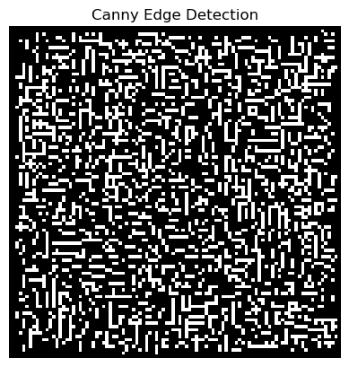

#### 在这段程序中我尝试使用torch对图像进行canny边缘处理。即进行高斯模糊去掉噪声后使用sobel卷积核计算像素点的梯度大小和方向，从而判断该点是否为边缘。

```python
import torch
import torch.nn.functional as F

def gaussian_kernel(size=5, sigma=1.0):
    """生成高斯核"""
    coords = torch.arange(size).float() - size // 2
    x_grid, y_grid = torch.meshgrid(coords, coords, indexing="ij")  # 添加 indexing 参数
    kernel = torch.exp(-(x_grid**2 + y_grid**2) / (2 * sigma**2))
    kernel /= kernel.sum()
    return kernel

def sobel_kernels():
    """生成Sobel核"""
    sobel_x = torch.tensor([[-1, 0, 1],
                            [-2, 0, 2],
                            [-1, 0, 1]], dtype=torch.float32)
    sobel_y = sobel_x.T
    return sobel_x, sobel_y

def canny_edge_detection(image, low_threshold, high_threshold):
    """实现Canny边缘检测"""
    # 高斯模糊
    gaussian = gaussian_kernel(size=5, sigma=1.0).unsqueeze(0).unsqueeze(0)
    image = F.conv2d(image.unsqueeze(0).unsqueeze(0), gaussian, padding=2)[0, 0]

    # 计算梯度
    sobel_x, sobel_y = sobel_kernels()
    grad_x = F.conv2d(image.unsqueeze(0).unsqueeze(0), sobel_x.unsqueeze(0).unsqueeze(0), padding=1)[0, 0]
    grad_y = F.conv2d(image.unsqueeze(0).unsqueeze(0), sobel_y.unsqueeze(0).unsqueeze(0), padding=1)[0, 0]
    gradient_magnitude = torch.sqrt(grad_x**2 + grad_y**2)#计算梯度大小
    gradient_direction = torch.atan2(grad_y, grad_x)#计算梯度方向

    # 非极大值抑制
    angle = gradient_direction * 180.0 / torch.pi#弧度转为角度
    angle[angle < 0] += 180
    nms = torch.zeros_like(gradient_magnitude)#建立一个与gradient_magnitude形状相同的全为0的张量用于存储非极大值抑制后的结果
    for i in range(1, gradient_magnitude.shape[0] - 1):
        for j in range(1, gradient_magnitude.shape[1] - 1):
            q, r = 255, 255
            # 判断梯度方向
            if (0 <= angle[i, j] < 22.5) or (157.5 <= angle[i, j] <= 180):#小角度选择左右两侧进行比较
                q = gradient_magnitude[i, j + 1]
                r = gradient_magnitude[i, j - 1]
            elif 22.5 <= angle[i, j] < 67.5:#45度附近选择对角线处进行比较
                q = gradient_magnitude[i + 1, j - 1]
                r = gradient_magnitude[i - 1, j + 1]
            elif 67.5 <= angle[i, j] < 112.5:#同理
                q = gradient_magnitude[i + 1, j]
                r = gradient_magnitude[i - 1, j]
            elif 112.5 <= angle[i, j] < 157.5:#同理
                q = gradient_magnitude[i - 1, j - 1]
                r = gradient_magnitude[i + 1, j + 1]

            if gradient_magnitude[i, j] >= q and gradient_magnitude[i, j] >= r:
                nms[i, j] = gradient_magnitude[i, j]

    # 双阈值检测,将边缘像素分为强边缘和弱边缘
    strong_edges = (nms > high_threshold).float()
    weak_edges = ((nms >= low_threshold) & (nms <= high_threshold)).float()

    # 边缘连接
    edges = strong_edges.clone()#先存储强边缘像素
    for i in range(1, edges.shape[0] - 1):
        for j in range(1, edges.shape[1] - 1):
            if weak_edges[i, j] == 1:#若弱边缘旁边有强边缘，则进行连接
                if (strong_edges[i - 1:i + 2, j - 1:j + 2] == 1).any():
                    edges[i, j] = 1

    return edges

# 测试代码
if __name__ == "__main__":
    # 示例输入图像（假设是灰度图像，范围[0, 1]）
    image = torch.rand(100, 100)  # 随机生成的灰度图像
    low_thresh = 0.1
    high_thresh = 0.3
    edges = canny_edge_detection(image, low_thresh, high_thresh)

    print(edges)
```

    tensor([[0., 0., 0.,  ..., 0., 0., 0.],
            [0., 0., 0.,  ..., 0., 0., 0.],
            [0., 0., 0.,  ..., 1., 0., 0.],
            ...,
            [0., 0., 0.,  ..., 0., 0., 0.],
            [0., 0., 0.,  ..., 0., 0., 0.],
            [0., 0., 0.,  ..., 0., 0., 0.]])
    


```python
import matplotlib.pyplot as plt

# 可视化结果
plt.imshow(image.numpy(), cmap='gray')
plt.title('source picture')
plt.axis('off')
plt.show()
plt.imshow(edges.numpy(), cmap='gray')
plt.title('Canny Edge Detection')
plt.axis('off')
plt.show()
```


    

    


    

    

