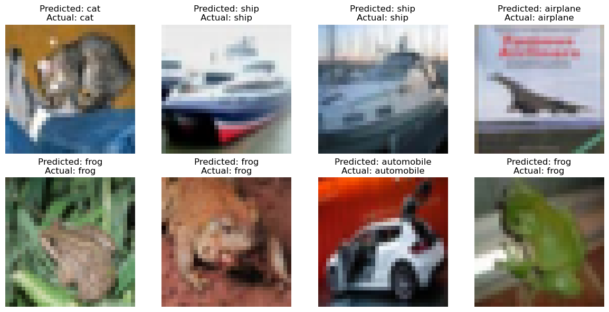

```python
import torch
import torch.nn as nn
import torch.optim as optim
from torchvision import datasets, transforms
import matplotlib.pyplot as plt
import numpy as np

# 数据预处理
transform = transforms.Compose([transforms.ToTensor(), transforms.Normalize((0.5,), (0.5,))])
train_data = datasets.CIFAR10(root='./data', train=True, download=True, transform=transform)
test_data = datasets.CIFAR10(root='./data', train=False, download=True, transform=transform)
train_loader = torch.utils.data.DataLoader(train_data, batch_size=64, shuffle=True)
test_loader = torch.utils.data.DataLoader(test_data, batch_size=64, shuffle=False)

# 定义简单 CNN
class SimpleCNN(nn.Module):
    def __init__(self):
        super(SimpleCNN, self).__init__()
        self.conv1 = nn.Conv2d(3, 16, kernel_size=3, padding=1)
        self.conv2 = nn.Conv2d(16, 32, kernel_size=3, padding=1)
        self.fc1 = nn.Linear(32 * 8 * 8, 128)
        self.fc2 = nn.Linear(128, 10)
        self.pool = nn.MaxPool2d(2, 2)
        self.relu = nn.ReLU()

    def forward(self, x):
        x = self.pool(self.relu(self.conv1(x)))
        x = self.pool(self.relu(self.conv2(x)))
        x = x.view(x.size(0), -1)
        x = self.relu(self.fc1(x))
        x = self.fc2(x)
        return x

device = torch.device('cuda' if torch.cuda.is_available() else 'cpu')
model = SimpleCNN().to(device)
criterion = nn.CrossEntropyLoss()
optimizer = optim.Adam(model.parameters(), lr=0.001)

# 训练模型
for epoch in range(5):
    model.train()
    total_loss = 0
    for images, labels in train_loader:
        images, labels = images.to(device), labels.to(device)
        optimizer.zero_grad()
        outputs = model(images)
        loss = criterion(outputs, labels)
        loss.backward()
        optimizer.step()
        total_loss += loss.item()
    print(f'Epoch {epoch+1}, Loss: {total_loss / len(train_loader)}')

# 测试模型并可视化预测结果
model.eval()
classes = train_data.classes  # CIFAR-10 类别标签
data_iter = iter(test_loader)  # 创建迭代器
images, labels = next(data_iter)  # 取出一批图像
images, labels = images.to(device), labels.to(device)

# 获取模型预测
with torch.no_grad():
    outputs = model(images)
    _, preds = torch.max(outputs, 1)

# 可视化图像及其预测
def imshow(img):
    img = img / 2 + 0.5  # 反归一化
    npimg = img.cpu().numpy()
    plt.imshow(np.transpose(npimg, (1, 2, 0)))

# 展示前8张图像及其预测标签
plt.figure(figsize=(12, 6))
for idx in range(8):
    plt.subplot(2, 4, idx + 1)
    imshow(images[idx])
    plt.title(f"Predicted: {classes[preds[idx]]}\nActual: {classes[labels[idx]]}")
    plt.axis('off')
plt.tight_layout()
plt.show()
```

    Downloading https://www.cs.toronto.edu/~kriz/cifar-10-python.tar.gz to ./data\cifar-10-python.tar.gz
    

    100.0%
    

    Extracting ./data\cifar-10-python.tar.gz to ./data
    Files already downloaded and verified
    Epoch 1, Loss: 1.4313949410567808
    Epoch 2, Loss: 1.0924872451883447
    Epoch 3, Loss: 0.940925012692771
    Epoch 4, Loss: 0.8306193488942998
    Epoch 5, Loss: 0.7436841102817174
    


    

    


```python

```
